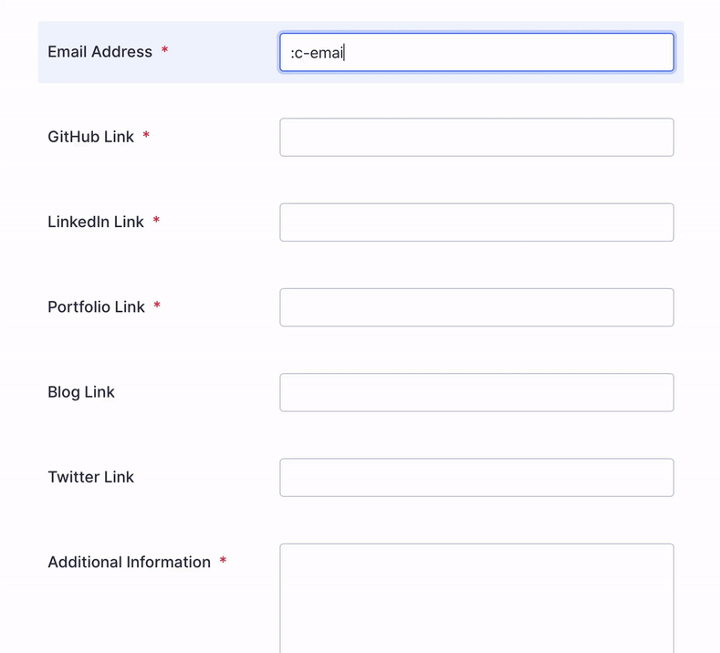

  

 </img>

#### fed up of copy and pasting urls, emoticons and icons when filling up application forms or organizing any other things??

#### here's the easy way to do: 👇🏽

 </img>

### installation:

how to install:

- download the `shortski.plist` file.
- change username and url's for all the handle's and add your's 😛
- save it and navigate to system preferences → keyboard → text
- drag and drop the downloaded `shortski.plist` to the `text` window and 🎉
